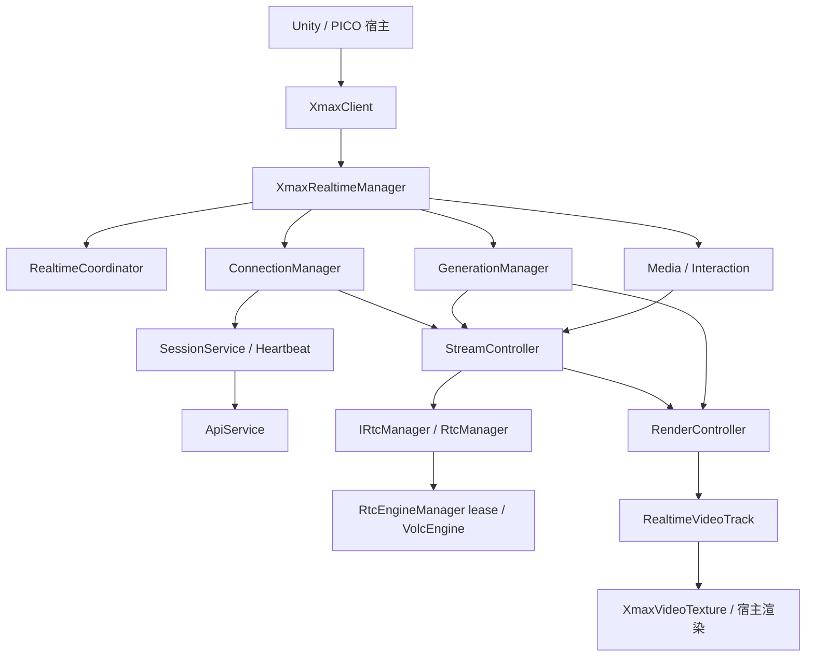

# XmaxSDK Unity 架构

本实现参考相邻 iOS SDK 的 `Sources/XmaxSDK` 当前工作树，针对 Unity 已有实时视频能力对齐模块职责和生命周期。版本保持 `1.0.0`。所有原有公开类型的命名空间仍为 `Xmax.SDK`，原有 Connect / Push / Start / Stop / Tracks 接口保留。

## 六层职责

| 层 | Unity 组件 | 与 iOS 的对应关系 |
| --- | --- | --- |
| Core | `XmaxClient`、`IXmaxRealtimeManager`、`XmaxRealtimeManager`、`RealtimeCoordinator`、连接和生成 Manager、错误分类 | Client 组合依赖，Realtime facade 委派业务，协调器统一操作准入、取消和清理 |
| Service | `IApiService` / `ApiService`、`IRealtimeSessionService` / `RealtimeSessionService`、`SessionHeartbeat`、`MediaService` | HTTP 与 Session 业务分离；心跳独立拥有可取消任务；模型尺寸规则集中 |
| Media | `MediaController`、`InteractionController`、`InteractionCoordinateMapper` | 拥有本地外部流，区分断开与关闭；处理生成交互及 Fit/Fill 坐标转换 |
| Stream | `IStreamController` / `StreamController`、`RtcRoomEvent`、网络质量模型 | Xmax 房间协议、任务 ID、SEI 匹配、订阅、房间心跳和生成控制 |
| Render | `RenderController`、`XmaxVideoTexture` | 远端轨道绑定、首帧就绪、停止后帧失效；通用 I420 平面纹理上传 |
| Foundation | `IRtcManager` / `RtcManager`、`RtcEngineManager`、`AsyncDeadline`、`JsonCodec`、`XmaxVideoFrame`、事件派发 | 封装原生 RTC、全局引擎租约、超时、序列化、帧校验和回调隔离 |

目录按职责组织，发布包仍使用 `Xmax.SDK` 单个业务程序集，避免拆程序集破坏现有消费者。原生厂商类型只出现在 `Foundation/RTC` 和 `ThirdParty`；厂商 JSON 类型只出现在 `Foundation/Serialization` 和 `ThirdParty`。Service、Stream 和 Core 通过接口及 SDK 自有模型协作。

远端流标识与 iOS 统一为 `Foundation/RTC/RemoteStream`，由房间和用户组成，表示远端主流。原生流索引的过滤与转换由 RTC 适配层负责。

## 生命周期契约

Unity 主线程承担 iOS actor / MainActor 的串行执行职责。协调器在发出事件前登记操作，每次异步等待后检查取消。公开 API 不会自动切换任意调用线程；应用在 Unity 主线程创建并使用 Manager。

连接顺序为：平台与参数校验 → 创建 Session → 校验 RTC 信息 → 绑定远端轨道 → 获取进程级 RTC 引擎租约并加入房间 → 启动心跳 → 提交 Connected。操作取消后才返回的 Session 也会关闭。Unity 原生 RTC 包装器使用全局单例，因此多个 Manager 通过可取消的租约排队，只有持有者能够释放引擎。

生成顺序为：解析 context → 重置首帧等待 → 发送 start 与周期 SEI → 匹配远端任务 ID → 等待对应远端流的有效首帧 → 提交 Generating。连接和 SEI 确认分别最多等待 15 秒、30 秒；匹配后首帧最多等待 10 秒。任务 ID 使用 `task-unity-` 加随机 UUID，避免毫秒时间戳碰撞。远端流重新发布后可重新匹配当前任务。

正在生成时传入空 context 复用当前任务，显式 context 更新当前条件。更新失败保留正在运行的任务；停止生成保留连接和最近成功的 context，断开连接则清除 context。

停止范围分为 Generation / Connection / All。停止请求先取消活动操作并等待其退出，再执行清理。重复请求复用同一个完成任务，更大的范围升级现有清理。断开包括停止生成、停止心跳、解除帧绑定、离开 RTC、释放引擎和关闭 Session；Close 额外使本地流失效。清理完成前拒绝新连接，避免旧清理覆盖新状态。状态监听器重入断开或关闭时仍遵守同一规则。

状态与帧事件中的宿主异常会记录日志，不中断清理。回调触发状态变化或帧失效后，剩余过期通知会被抑制。异步致命错误清理后通过 `ErrorOccurred` 通知；API 调用失败由 Task 抛出；关闭 Session 的网络失败作为 `CleanupWarning` 报告。

## 媒体与渲染边界

Unity 与 PICO 相机、手部追踪、权限及场景 UI 的生命周期不同于 iOS。SDK 使用显式本地外部流接收 RGBA、BGRA、I420；输入帧尺寸允许与编码输出不同。Disconnect 保留本地流以支持预览，Close 才关闭它。显式创建的本地流只可连接其所属 Manager。

渲染目前在主线程同步分发，由 `RenderController` 保存最新有效帧和首帧等待状态，不额外建立跨线程积压队列。`XmaxVideoTexture` 支持 I420 行步长、动态尺寸和轨道自动绑定；宿主保留 shader、UV 旋转、镜像、色彩转换及 XR 门户效果。帧引用借用数组；异步处理或需要独立所有权时使用 Clone。

交互坐标采用左上角原点。Fit 模式拒绝黑边，Fill 模式补偿居中裁切；发送前按编码尺寸检查边界。当前保留同步 SendTracks，不增加可能改变手势频率的节流行为。

## 尚未移植的 iOS 能力

| 能力 | Unity 当前情况 |
| --- | --- |
| 原生 Camera / Image / Video 媒体源与切换、系统权限、音频路由 | 由 Unity / PICO 宿主管理采集，通过本地外部流接入；SDK 尚无自动摄像头或音频 API |
| Storage / 文件上传 | 未实现；现有 `ReferencePath` 接收服务端已有资源路径 |
| Apple 平台帧插值、Metal 处理链与音视频同步 | 未移植；当前为同步 I420 分发和 Unity 纹理上传 |
| 完整质量策略、详细阶段耗时与日志配置 | 提供网络质量事件与 Unity 错误日志；尚无性能自适应、完整阶段计时或统一可配置日志系统 |
| 多平台 RTC 后端 | 接口已隔离；当前仅随包提供 Android ARM64 原生库 |

这些是能力差异；当前六层模块和接口为后续实现提供接入点，不宣称与 iOS 功能完全一致。

## 验证边界

EditMode 测试使用 Session、Stream 和 RTC 替身，覆盖连接取消、迟到的 Session、断开合并和升级、状态监听器重入、首帧确认、条件更新、旧心跳失效、SEI 超时与故障、引擎租约、坐标、模型尺寸、JSON 响应和纹理步长。测试随 UPM 包发布，消费工程显式设置 testables 后执行。

本地 CI 另行编译最小消费端并构建 Android IL2CPP/ARM64 APK，校验 RTC 原生库。测试不创建真实在线 Session；生成首帧、网络抖动、重新发布和 PICO 输入链仍需带凭据的 Android 真机联调。
